<div align="center">


# 🕌 صوت صلاه — Sout Salah

**A premium Islamic mobile application for Quran recitations, mosque prayer recordings, offline audio listening, and daily Islamic videos.**

[](https://flutter.dev)
[](https://dart.dev)
[](https://riverpod.dev)
[](https://supabase.com)
[](https://www.cloudflare.com/developer-platform/r2/)
[](https://firebase.google.com/)
[](LICENSE)

[Features](#-features) • [Screenshots](#-screenshots--app-tour) • [Tech Stack](#%EF%B8%8F-tech-stack) • [Architecture](#%EF%B8%8F-architecture) • [Getting Started](#-getting-started) • [Security](#-security--public-repo-safety) • [Database](#%EF%B8%8F-database-schema)

</div>

---

## 📖 Overview

**Sout Salah (صوت صلاه)** is a production-grade Flutter application crafted to connect Muslims with their local mosques and daily worship. The app organizes daily prayer recordings (Taraweeh, Tahajjud, Fajr, etc.) by mosque and Ramadan days, with background audio playback, offline downloads, OpenStreetMap mosque geolocation, and daily 4K video broadcasts powered by Supabase and Cloudflare R2.

Built strictly following **Clean Architecture** principles and **Riverpod** state management, Sout Salah provides an ad-free, intuitive, and spiritually uplifting user experience.

---

## 📸 Screenshots & App Tour

<div align="center">

### 📱 Core Experience & Worship

| 🚀 Animated Splash | 🕌 Mosques Explorer | 🗺️ Interactive Map | 📅 Prayer Schedule |
|:---:|:---:|:---:|:---:|
| 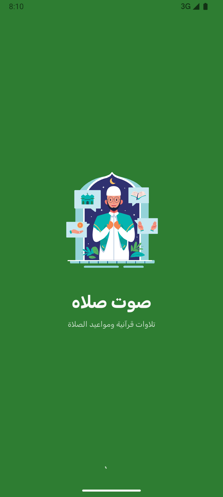 | 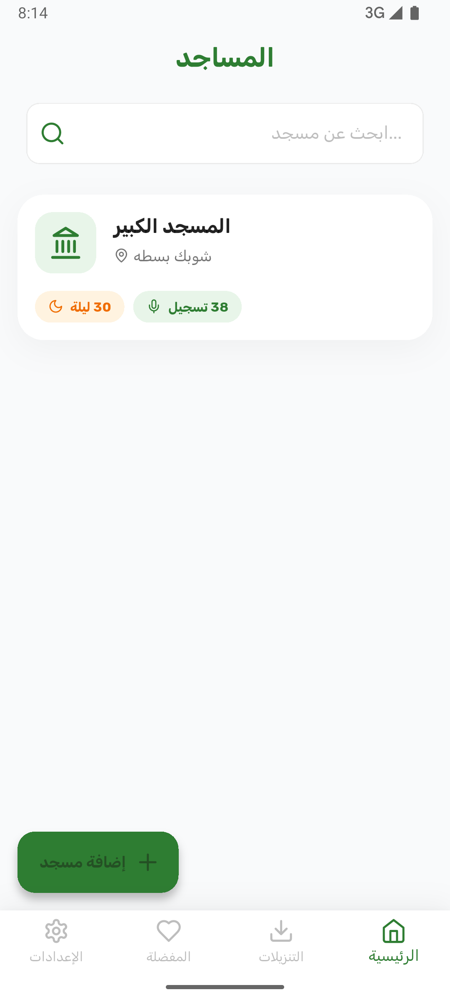 |  | 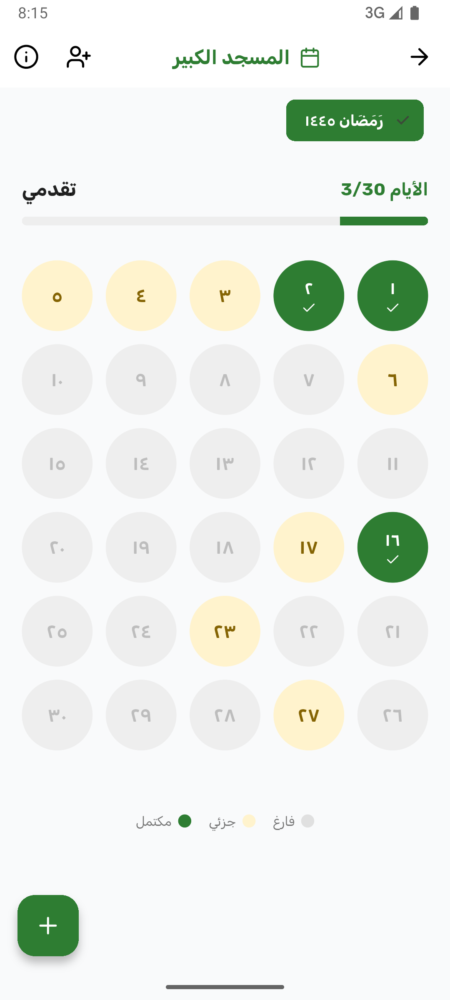 |
| *Lottie vector animation* | *Browse mosques & reciters* | *OpenStreetMap geolocation* | *Ramadan daily prayers* |

<br/>

### 🎧 Audio & Media Player

| 🎧 Audio Player Sheet | 🔔 Lock Screen Controls | 💾 Offline Downloads | 📹 Daily 4K Video |
|:---:|:---:|:---:|:---:|
| 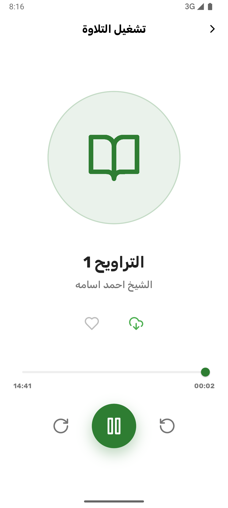 | 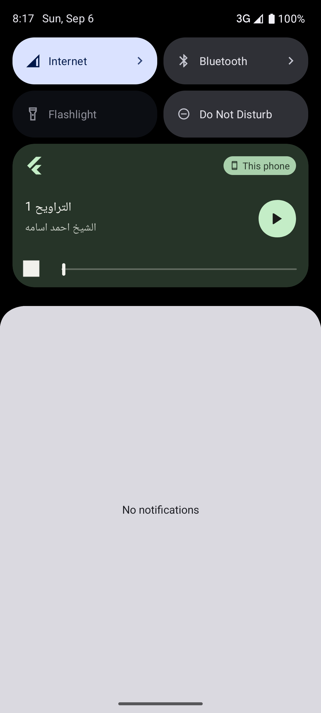 | 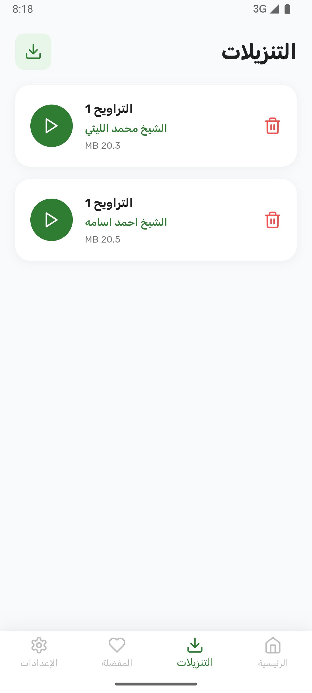 | 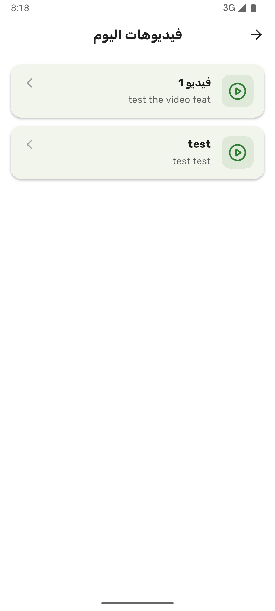 |
| *Seek bar & speed control* | *System media notification* | *Listen without internet* | *Chewie & hardware player* |

<br/>

### ⚙️ Admin Tools & Authentication

| ☁️ Upload Recording | 🎬 Upload Daily Video | 📍 Add Mosque & GPS | 👤 Auth & Guest Mode |
|:---:|:---:|:---:|:---:|
| 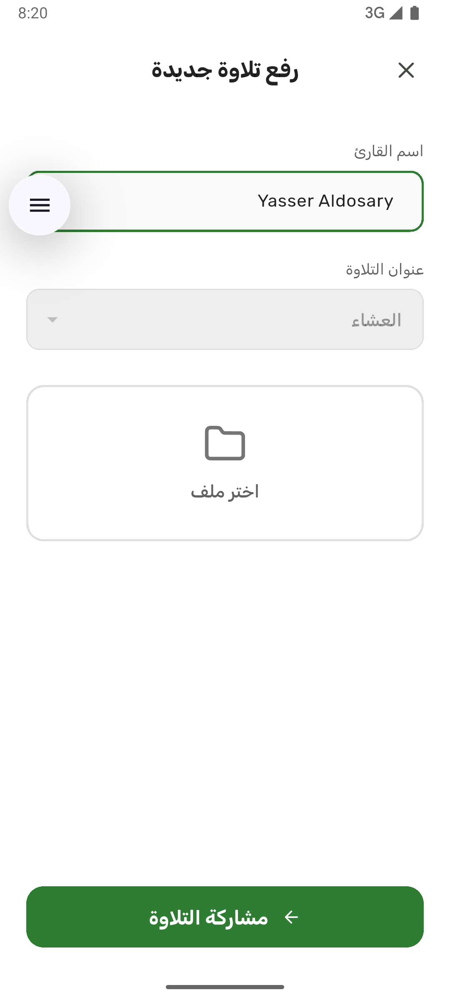 | 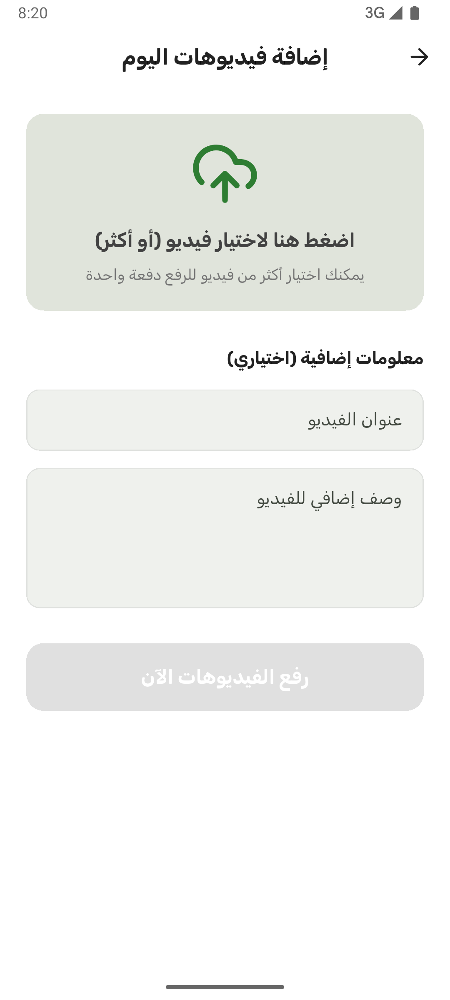 | 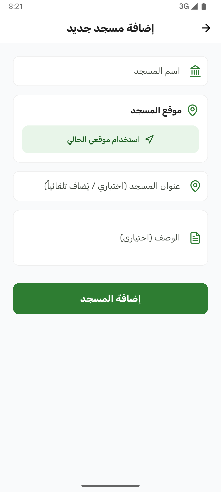 | 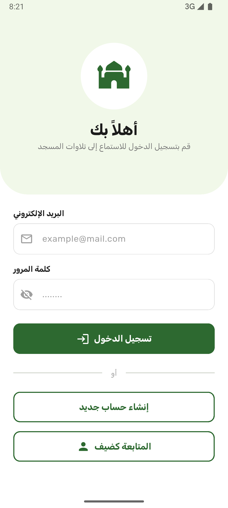 |
| *Cloudflare R2 direct upload* | *High-bitrate video upload* | *Interactive GPS pin picker* | *Instant guest or publisher* |

</div>

> 💡 *Note: Screenshot image files are located in `docs/screenshots/`. See [`docs/screenshots/README.md`](docs/screenshots/README.md) for screenshot capture guidelines.*

---

## ✨ Features

### 🕌 Mosque & Prayer Audio Management
- **Day-by-Day Ramadan Catalog:** Prayers organized chronologically by Ramadan day and prayer category (Tahajjud, Taraweeh, Fajr, Isha, etc.).
- **Interactive OpenStreetMap Explorer:** Visual map powered by `flutter_map` displaying mosques with live GPS user distance calculation.
- **Search & Filtering:** Search mosques by name, city, publisher, or prayer type.

### 🎧 High-Fidelity Audio Engine
- **Background Playback & Lock Screen Controls:** Full playback management via `just_audio_background` with lock screen artwork and status notification controls.
- **Persistent Bottom Player Sheet:** Expandable/collapsible bottom sheet player with waveform seeker, speed modifier, forward/rewind 10s, and loop toggles.
- **Local Audio Selector:** Browse and play local `.mp3`/`.m4a` recitations stored on the device with `on_audio_query`.

### 💾 Offline Downloads & Favorites
- **Resilient Offline Downloads:** Fast concurrent downloads via `Dio` with real-time percentage progress indicators and local disk caching.
- **Favorites Library:** Instant one-tap bookmarking available offline without requiring an account.

### 📹 Daily Islamic Video Broadcasts
- **HD & 4K Streaming:** Hardware-accelerated video playback with Chewie UI controls.
- **Cloudflare R2 Direct Uploads:** Admin video and audio uploads with AWS SigV4 HMAC-SHA256 request signing.

### 🔔 Push Notifications & Updates
- **Firebase Cloud Messaging (FCM):** Live notification alerts for newly published recordings, video uploads, and community notices.
- **Dynamic Startup Check:** Remote announcements and redirect messages managed directly via Supabase.

### 👤 Hybrid Auth & Seamless Guest Mode
- **Zero Friction:** Immediate access to all audio listening, search, map, and offline features in Guest Mode.
- **Mosque Publisher Role:** Supabase Authentication and Role-Based Access Control (RBAC) for mosque administrators to manage listings and uploads.

---

## 🛠️ Tech Stack

### Framework & Core Architecture
| Dependency | Version | Purpose |
|---|---|---|
| [Flutter SDK](https://flutter.dev) | `^3.10.7` | Multi-platform UI framework |
| [Dart SDK](https://dart.dev) | `^3.0.0` | Strongly typed modern language |
| [flutter_riverpod](https://pub.dev/packages/flutter_riverpod) | `^2.6.1` | Reactive state management & dependency injection |
| [get_it](https://pub.dev/packages/get_it) | `^9.2.0` | Fast service locator for core background singletons |
| [dartz](https://pub.dev/packages/dartz) | `^0.10.1` | Functional error handling (`Either<Failure, T>`) |
| [equatable](https://pub.dev/packages/equatable) | `^2.0.8` | Value equality for entities & immutable states |

### Audio & Video Playback
| Dependency | Version | Purpose |
|---|---|---|
| [just_audio](https://pub.dev/packages/just_audio) | `^0.9.42` | Feature-rich audio player |
| [just_audio_background](https://pub.dev/packages/just_audio_background) | `^0.0.1-beta.17` | Background media session & notification controls |
| [audio_session](https://pub.dev/packages/audio_session) | `^0.1.21` | Audio focus and hardware interruptions |
| [on_audio_query](https://pub.dev/packages/on_audio_query) | `^2.9.0` | Local device storage audio querying |
| [video_player](https://pub.dev/packages/video_player) | `^2.11.1` | Hardware accelerated video decoder |
| [chewie](https://pub.dev/packages/chewie) | `^1.8.5` | Material video player controller UI |

### Backend, Cloud Storage & Network
| Dependency | Version | Purpose |
|---|---|---|
| [supabase_flutter](https://pub.dev/packages/supabase_flutter) | `^2.12.0` | PostgreSQL Database & Authentication |
| [dio](https://pub.dev/packages/dio) | `^5.9.1` | High-performance HTTP client for file downloads |
| [crypto](https://pub.dev/packages/crypto) | `^3.0.3` | AWS Signature Version 4 HMAC-SHA256 signing for R2 |
| [firebase_messaging](https://pub.dev/packages/firebase_messaging) | `^16.1.2` | Push notifications via Firebase Cloud Messaging |
| [firebase_core](https://pub.dev/packages/firebase_core) | `^4.5.0` | Firebase initialization |

### Maps, Geolocation & UI
| Dependency | Version | Purpose |
|---|---|---|
| [flutter_map](https://pub.dev/packages/flutter_map) | `^7.0.1` | Interactive OpenStreetMap rendering |
| [latlong2](https://pub.dev/packages/latlong2) | `^0.9.1` | Geographic calculations and coordinates |
| [geolocator](https://pub.dev/packages/geolocator) | `^13.0.0` | Real-time GPS location and distance tracking |
| [geocoding](https://pub.dev/packages/geocoding) | `^3.0.0` | Reverse geocoding (coordinates to addresses) |
| [lottie](https://pub.dev/packages/lottie) | `^3.1.0` | Vector animation rendering |
| [lucide_icons](https://pub.dev/packages/lucide_icons) | `^0.257.0` | Clean, modern iconography |

---

## 🏗️ Architecture

Sout Salah is structured around **Clean Architecture**, enforcing separation of concerns across distinct boundaries:

```
┌──────────────────────────────────────────────────────────┐
│                   PRESENTATION LAYER                     │
│  (Widgets, Pages, Riverpod Controllers, UI States)       │
└────────────────────────────┬─────────────────────────────┘
                             │ calls
┌────────────────────────────▼─────────────────────────────┐
│                      DOMAIN LAYER                        │
│   (Entities, Business Logic, Abstract Repositories,      │
│                     Use Cases)                           │
└────────────────────────────▲─────────────────────────────┘
                             │ implements
┌────────────────────────────┴─────────────────────────────┐
│                       DATA LAYER                         │
│  (Data Sources, Models & Mappers, Repository Impls,      │
│          Supabase Client, Cloudflare R2 APIs)            │
└──────────────────────────────────────────────────────────┘
```

### 📁 Directory Layout

```text
lib/
├── main.dart                          # App initialization, Supabase, Firebase & DI setup
│
├── core/                              # Shared cross-cutting infrastructure
│   ├── config/
│   │   └── app_config.dart            # Compile-time environment configuration
│   ├── constants/
│   │   └── app_constants.dart         # Global constants & prayer definitions
│   ├── di/
│   │   ├── injection_container.dart   # GetIt locator for singleton services
│   │   └── providers.dart             # Global Riverpod providers
│   ├── error/
│   │   ├── exceptions.dart            # Low-level data layer exceptions
│   │   └── failures.dart              # Domain-level failure representations
│   ├── models/
│   │   ├── downloaded_recording.dart  # Offline storage model
│   │   └── favorite_recording.dart    # Favorites model
│   ├── routes/
│   │   ├── app_router.dart            # Centralized route dispatch & guards
│   │   ├── app_routes.dart            # Static route paths
│   │   └── route_transitions.dart     # Smooth page transitions
│   ├── services/
│   │   ├── audio_player_service.dart  # Audio streaming, media metadata & controls
│   │   ├── downloads_service.dart     # Background file downloader & progress emitter
│   │   ├── favorites_service.dart     # Reactive local favorites storage
│   │   ├── fcm_service.dart           # Push notifications token & handler
│   │   ├── navigation_service.dart    # Global context-free routing
│   │   ├── r2_storage_service.dart    # Cloudflare R2 AWS SigV4 upload/delete
│   │   └── startup_service.dart       # Remote broadcast & config checker
│   ├── theme/
│   │   └── app_theme.dart             # Material 3 typography & Islamic color palette
│   └── utils/
│       ├── app_logger.dart            # Formatted console & file logger
│       └── permission_checker.dart    # Runtime permissions helper
│
└── features/                          # Self-contained feature modules
    ├── auth/                          # Authentication & Publisher Profiles
    │   ├── data/                      # Supabase Auth datasource & profile models
    │   ├── domain/                    # Auth entities, repositories & usecases
    │   └── presentation/              # Login, Sign Up, Profile & Riverpod controllers
    │
    ├── home/                          # Main Shell & Dashboard Navigation
    │   └── presentation/              # Mosques tab, Downloads tab, Favorites tab, Settings
    │
    └── mosques/                       # Mosque catalog, Recordings, Videos & Map
        ├── data/                      # Mosque & recording remote datasources
        ├── domain/                    # Mosque, recording, video & schedule entities
        └── presentation/              # Detail pages, map selector, audio sheets & uploaders
```

---

## 🚀 Getting Started

Follow these steps to set up and run Sout Salah locally.

### 📋 Prerequisites

- **Flutter SDK:** `^3.10.7` (Dart `^3.0.0`)
- **Android Studio** or **VS Code** with Flutter extensions
- **Supabase Account:** Free tier at [supabase.com](https://supabase.com)
- **Cloudflare R2 Account (Optional):** For uploading audio/video recordings
- **Firebase Project (Optional):** For Push Notifications (FCM)

---

### 1️⃣ Clone the Repository

```bash
git clone https://github.com/eslam-9/sout_salah.git
cd sout_salah
```

### 2️⃣ Install Dependencies

```bash
flutter pub get
```

### 3️⃣ Configure Environment Secrets

Create a `secrets.json` file in the root directory by copying the provided template:

```bash
cp secrets.example.json secrets.json
```

Populate `secrets.json` with your credentials:

```json
{
  "SUPABASE_URL": "https://your-project.supabase.co",
  "SUPABASE_ANON_KEY": "your-supabase-anon-key",
  "R2_ENDPOINT": "https://your-account-id.r2.cloudflarestorage.com",
  "R2_ACCESS_KEY": "your-cloudflare-r2-access-key",
  "R2_SECRET_KEY": "your-cloudflare-r2-secret-key",
  "R2_BUCKET": "your-bucket-name",
  "R2_CDN_URL": "https://your-public-cdn-url.r2.dev"
}
```

> ⚠️ **CRITICAL SECURITY NOTE:** Never commit `secrets.json` to version control. It is strictly excluded via `.gitignore`.

---

### 4️⃣ Set Up Supabase Database

Run the SQL schema located in [`database_schema.sql`](database_schema.sql) in your Supabase SQL Editor. This will automatically configure:
- All required tables (`profiles`, `mosques`, `recordings`, `daily_videos`, `ramadan_days`, `fcm_tokens`, `data`).
- Row Level Security (RLS) policies.
- Foreign keys, triggers, and indices.

---

### 5️⃣ Run the App

#### In Debug Mode
```bash
flutter run --dart-define-from-file=secrets.json
```

#### In Profile Mode
```bash
flutter run --profile --dart-define-from-file=secrets.json
```

---

### 6️⃣ Build Production Artifacts

#### Android APK
```bash
flutter build apk --release --dart-define-from-file=secrets.json
```

#### Android App Bundle (Google Play)
```bash
flutter build appbundle --release --dart-define-from-file=secrets.json
```

#### iOS Release (Requires macOS & Xcode)
```bash
flutter build ipa --release --dart-define-from-file=secrets.json
```

---

## 🔒 Security & Public Repo Safety

This repository is engineered to be **100% safe for open-source and public hosting**:

1. **Compile-Time Env Injection:** Sensitive API credentials (`SUPABASE_URL`, `SUPABASE_ANON_KEY`, `R2_ACCESS_KEY`, etc.) are injected at build time using `--dart-define-from-file=secrets.json`. No credentials exist in the committed codebase.
2. **Strict Git Ignore Rules:** `secrets.json`, `env.json`, `android/app/google-services.json`, `ios/Runner/GoogleService-Info.plist`, and `key.properties` are strictly gitignored.
3. **AWS SigV4 Signing:** Cloudflare R2 uploads utilize temporary, HMAC-SHA256 authenticated REST calls constructed dynamically.
4. **Guest Mode Isolation:** Guest mode stores user preferences and downloaded items strictly in local device sandbox (`SharedPreferences` and app document directory).

---

## 🗃️ Database Schema

Sout Salah uses PostgreSQL on Supabase. Below is a summary of the core tables:

| Table | Purpose | Key Fields |
|---|---|---|
| `profiles` | User & publisher account data | `id`, `email`, `role`, `publisher_name`, `created_at` |
| `mosques` | Mosque directory entries | `id`, `name`, `city`, `latitude`, `longitude`, `publisher_id` |
| `recordings` | Audio prayer recordings | `id`, `mosque_id`, `day_number`, `prayer_name`, `audio_url`, `duration` |
| `daily_videos` | Daily 4K Islamic broadcast videos | `id`, `mosque_id`, `day_number`, `title`, `video_url`, `thumbnail_url` |
| `ramadan_days` | Ramadan day index & dates | `id`, `mosque_id`, `day_number`, `hijri_date`, `is_published` |
| `fcm_tokens` | Device tokens for push notifications | `id`, `user_id`, `token`, `platform`, `updated_at` |
| `data` | Dynamic startup notices & redirects | `id`, `key`, `value`, `is_active` |

> 📜 Complete SQL migration scripts and RLS definitions are available in [`database_schema.sql`](database_schema.sql).

---

## 🤝 Contributing

Contributions, bug reports, and feature requests are warmly welcomed!

1. Fork the Project
2. Create your Feature Branch (`git checkout -b feature/AmazingFeature`)
3. Commit your Changes (`git commit -m 'feat: add some amazing feature'`)
4. Push to the Branch (`git push origin feature/AmazingFeature`)
5. Open a Pull Request

---

## 📄 License

This project is licensed under the **MIT License** — see the [LICENSE](LICENSE) file for details.

---

<div align="center">

**صوت صلاه — Sout Salah**  
*Built with ❤️ for the Muslim Ummah.*

[](https://github.com/eslam-9/sout_salah)
[](https://github.com/eslam-9/sout_salah)

</div>
