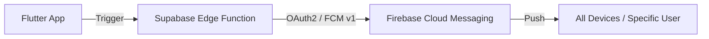

# technical_explanation.md

## 1. Notification System

### Architecture
The notification system follows a modern serverless architecture using **Flutter**, **Supabase Edge Functions**, and **Firebase Cloud Messaging (FCM)**.

### Key Components
- **Flutter `NotificationService`**: Handles Firebase initialization, token registration/refresh, and invoking the Edge Function.
- **`fcm_tokens` Table**: Stores mapping between `user_id` and their FCM tokens for targeted or global delivery.
- **`send-notification` Edge Function**: A Deno-based function that:
    - Authenticates with Google via a Service Account.
    - Resolves target tokens from the database.
    - Sends notifications using the FCM HTTP v1 API.

### Supported Events
1.  **New Recording**: Notifies all users when a new prayer recording is uploaded.
2.  **Publisher Added**: A personal notification sent to a user when they are granted publishing rights for a mosque.
3.  **Day Schedule Update**: A manual broadcast triggered by admins to announce the daily prayer schedule is ready.

---

## 2. Mosque Month Feature (`addMonth`)

### Purpose
The `addMonth` feature allows mosque administrators to prepare for upcoming months (like Ramadan) by pre-generating placeholders for each day. This ensures that recordings and schedules can be assigned to specific days within a structured monthly view.

### Implementation Details
- **Data Source Logic**: The `MosqueRemoteDataSource.addMonth` method handles the batch insertion.
- **Database Table**: `ramadan_days`.
    - Fields: `mosque_id`, `day_number` (1-30), `month`, `year`.
- **Process**:
    1. The admin selects a month and year.
    2. The app generates 30 day entries.
    3. A single batch `INSERT` is performed to Supabase.
    4. These days then appear in the mosque's "Monthly Schedule" view.

---

## 3. Day Schedule Table

### Overview
The Day Schedule Table is a specialized feature allowing mosques to publish their daily "Imam" or "Sheikh" schedule for different prayers (Fajr, Taraweeh, etc.).

### Technical Structure
- **Table**: `day_schedule`.
- **Linked Data**: Each schedule entry is linked to a specific day in `ramadan_days`.
- **Fields**:
    - `salah`: The name of the prayer (Arabic).
    - `shikh`: The name of the Sheikh leading the prayer.
    - `comments`: Optional notes (e.g., "Short talk after prayer").
    - `sort_order`: Controls the display sequence (typically by prayer time).

### Admin Workflow & Notifications
Admins can dynamically add or edit rows in this table. Once the schedule for a day is finalized:
1.  Admin clicks **"إرسال إشعار بالجدول"** (Send Schedule Notification).
2.  The app calls `NotificationService.sendNotification(type: 'day_schedule', ...)`.
3.  All users following the mosque receive a push notification about the new schedule.
