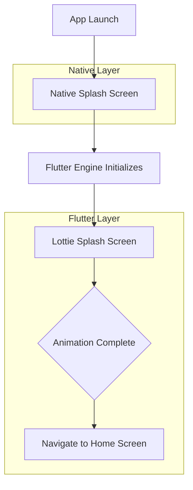
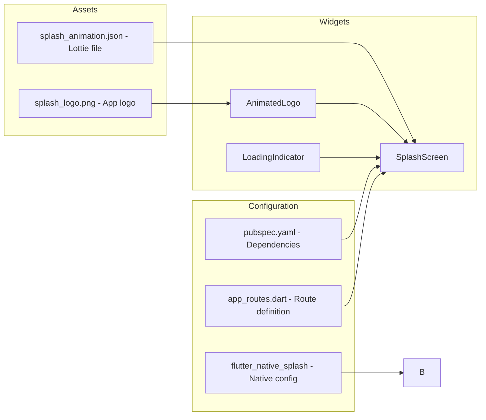
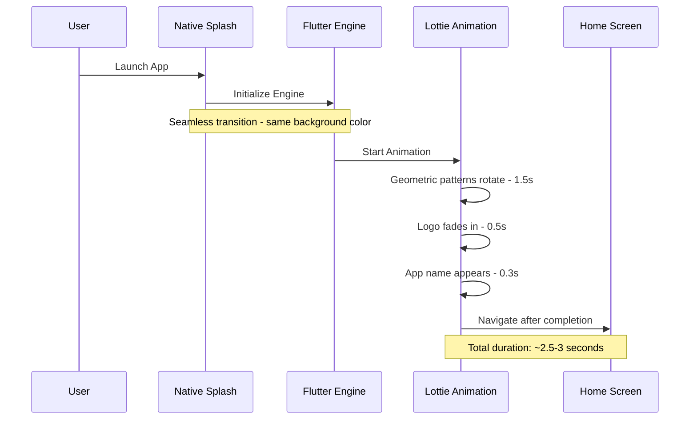

# Modern Animated Splash Screen Plan

## Overview
This plan outlines the implementation of a modern animated splash screen for the **Sout Salah** Flutter app using a hybrid approach: a native splash screen that seamlessly transitions to a Lottie animated splash screen with Islamic geometric patterns.

## Architecture

### Splash Screen Flow



### Component Structure



## Implementation Details

### 1. Dependencies Required

Add to [`pubspec.yaml`](pubspec.yaml):
```yaml
dependencies:
  lottie: ^3.1.0  # For Lottie animations
```

### 2. File Structure

```
lib/
├── core/
│   ├── presentation/
│   │   └── pages/
│   │       └── splash_screen.dart     # New splash screen widget
│   └── routes/
│       └── app_routes.dart            # Add splash route
assets/
├── animations/
│   └── splash_animation.json          # Placeholder Lottie file
└── splash_logo.png                    # App logo for splash
```

### 3. Native Splash Configuration

Update [`pubspec.yaml`](pubspec.yaml) flutter_native_splash section:
```yaml
flutter_native_splash:
  color: "#2E7D32"  # Match AppColors.primary
  image: assets/splash_logo.png
  
  android: true
  ios: true
  
  android_12:
    image: assets/splash_logo.png
    icon_background_color: "#2E7D32"
    color: "#2E7D32"
```

### 4. SplashScreen Widget Design

The [`SplashScreen`](lib/core/presentation/pages/splash_screen.dart) widget will feature:

- **Background**: Solid color matching native splash - `#2E7D32` (AppColors.primary)
- **Lottie Animation**: Islamic geometric patterns that rotate and fade
- **Logo Reveal**: App logo fades in after geometric animation
- **App Name**: "صوت صلاح" text with fade-in animation
- **Loading Indicator**: Subtle loading animation at bottom

### 5. Animation Sequence



### 6. Color Scheme

| Element | Color | Hex Code |
|---------|-------|----------|
| Background | Primary Green | `#2E7D32` |
| Geometric Patterns | Light Green/White | `#E8F5E9` / `#FFFFFF` |
| App Name | White | `#FFFFFF` |
| Loading Indicator | Light Green | `#8AD38C` |

### 7. Lottie Animation Placeholder

The placeholder Lottie file will include:
- Simple geometric shapes (hexagons, stars, circles)
- Rotation and scale animations
- Fade transitions
- Duration: 2-3 seconds

**Note**: You will need to replace the placeholder with a custom Lottie animation from:
- [LottieFiles.com](https://lottiefiles.com) - Search for "Islamic geometric" or "Arabic pattern"
- Custom animation created with Adobe After Effects + Bodymovin plugin
- Hire a designer on Fiverr/Upwork for custom Islamic geometric animation

## Tasks Breakdown

### Phase 1: Setup
- [ ] Add `lottie` package to [`pubspec.yaml`](pubspec.yaml)
- [ ] Create `assets/animations/` directory
- [ ] Add placeholder Lottie JSON file

### Phase 2: Native Splash
- [ ] Update `flutter_native_splash` configuration
- [ ] Run `flutter pub run flutter_native_splash:create`
- [ ] Verify native splash on both Android and iOS

### Phase 3: Flutter Splash Screen
- [ ] Create [`SplashScreen`](lib/core/presentation/pages/splash_screen.dart) widget
- [ ] Implement Lottie animation with controller
- [ ] Add logo and app name with animations
- [ ] Add navigation logic after animation completes

### Phase 4: Integration
- [ ] Add splash route to [`app_routes.dart`](lib/core/routes/app_routes.dart)
- [ ] Update [`main.dart`](lib/main.dart) to use splash as initial route
- [ ] Ensure smooth transition from native to Flutter splash

### Phase 5: Testing & Polish
- [ ] Test on Android devices
- [ ] Test on iOS devices
- [ ] Adjust animation timing
- [ ] Verify no jank or frame drops

## Code Snippets

### SplashScreen Widget Structure

```dart
class SplashScreen extends StatefulWidget {
  const SplashScreen({super.key});

  @override
  State<SplashScreen> createState() => _SplashScreenState();
}

class _SplashScreenState extends State<SplashScreen> 
    with TickerProviderStateMixin {
  late AnimationController _lottieController;
  
  @override
  void initState() {
    super.initState();
    _lottieController = AnimationController(vsync: this);
  }

  @override
  void dispose() {
    _lottieController.dispose();
    super.dispose();
  }

  @override
  Widget build(BuildContext context) {
    return Scaffold(
      backgroundColor: AppColors.primary,
      body: Center(
        child: Column(
          mainAxisAlignment: MainAxisAlignment.center,
          children: [
            // Lottie animation
            // Logo with fade animation
            // App name with slide animation
            // Loading indicator
          ],
        ),
      ),
    );
  }
}
```

## Resources

- [Lottie Package](https://pub.dev/packages/lottie)
- [flutter_native_splash](https://pub.dev/packages/flutter_native_splash)
- [LottieFiles - Islamic Animations](https://lottiefiles.com/search?q=islamic&category=animations)
- [Islamic Geometric Patterns Examples](https://lottiefiles.com/search?q=geometric%20pattern&category=animations)

## Notes

1. **Performance**: Keep Lottie file size under 100KB for optimal performance
2. **Accessibility**: The splash screen should not block users for more than 3 seconds
3. **Branding**: Ensure the splash screen matches the app's Islamic theme and green color scheme
4. **Dark Mode**: Consider adding a dark mode variant of the splash screen
